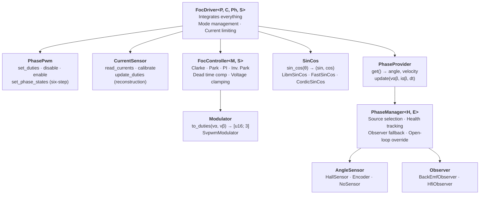
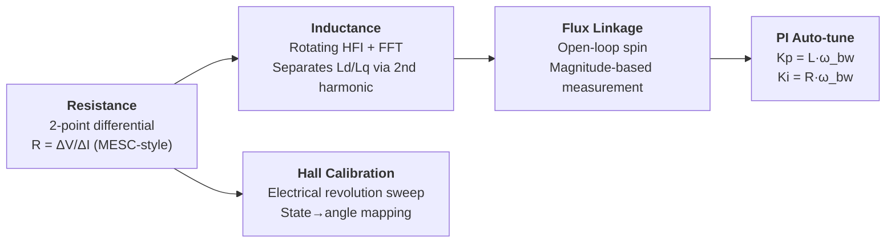

# OxiFOC

Field-Oriented Control (FOC) firmware for STM32 motor controllers, written in Rust with [Embassy](https://embassy.dev/). Device-host communication uses [ergot](https://github.com/jamesmunns/ergot).

## Core Architecture (`oxifoc-core`)

All FOC algorithms and motor control logic live in `oxifoc-core` — a `no_std` library with no hardware dependencies. Platform crates provide trait implementations for their specific hardware (ADC, PWM, sensors).

### Trait Abstraction



Platform crates implement `PhasePwm` (TIM1 complementary PWM), `CurrentSensor` (shunt ADC reading), and `SinCos` (CORDIC hardware or software libm). Everything else is shared.

### Phase Source Selection

`PhaseManager` supports multiple angle estimation strategies with runtime switching:

| Source | Use Case |
|--------|----------|
| `Hall` | Direct Hall sensor angle |
| `Encoder` | Incremental encoder |
| `Observer` | Back-EMF sensorless (high speed) |
| `Hfi` | High-frequency injection sensorless (zero/low speed) |
| `HallToObserver` | Hall at low speed, velocity-blended crossover to observer |
| `HallWithFallback` | Hall → Observer with automatic fallback on Hall failure |
| `HfiToObserver` | HFI startup → observer crossover |
| `Manual` / `OpenLoop` | Calibration and detection |

### Motor Detection

Automated parameter measurement, platform-agnostic via `DetectionHardware` trait:



Each step uses conservative PI gains (`DETECTION_PI_KP/KI`) delivered via `ControlMode::OpenLoop { pi_gains }`. Detection accuracy validated against 10 simulated motors (`detection_report` example).

### Virtual Motor

`VirtualMotor` simulates a PMSM electrically and mechanically (R, Ld, Lq, flux linkage, inertia, friction). Combined with `FocController`, it enables closed-loop testing of the full detection pipeline and FOC control without hardware.

```bash
cargo run -p oxifoc-core --example detection_report --features virtual-motor,std
```

### Control Modes

```rust
enum ControlMode {
    Stopped,                        // PWM disabled
    CurrentControl { iq, id },      // Torque/field control
    OpenLoop { angle, current, velocity, pi_gains },  // Detection/calibration
    DirectVoltage { vd, vq, angle },// Bypass PI (HFI measurement)
    Coast,                          // All FETs off (flux measurement)
    SixStep { duty },               // Trapezoidal (bringup)
    VelocityControl, PositionControl, // TODO
}
```

### Fast Telemetry

Lock-free ISR → host streaming via bbqueue:

```
ISR (20kHz) → decimation (atomic period) → bbqueue (2KB) → async drain → ergot topic → host
```

46 bytes/sample (ia/ib/ic/id/iq/vd/vq/angle/erpm/duty/hall/seq). Zero overhead when disabled. Overflow drops samples silently.

## Hardware

| Board | MCU | Current Sensing | Communication | Gate Driver |
|-------|-----|-----------------|---------------|-------------|
| B-G431B-ESC1 | STM32G431CB | 3 op-amps (PGA x16) | UART / RTT | Integrated |
| Cheap FOCer 2 | STM32F405RG | DRV8301 (10 V/V) | USB | DRV8301 SPI |
| NUCLEO-G474RE + IHM08M1 | STM32G474RE | External op-amps | UART / RTT | L6398 |

All platforms: 20 kHz center-aligned PWM, TIM1-triggered injected ADC, Hall polling via TIM6 (5 us, 7-read majority voting), persistent config in internal flash (`sequential-storage` + `postcard`).

## Host Tools

**GUI** (`oxifoc-host-slint`) — Slint desktop app with GPU-accelerated real-time charts (WGPU). Motor control, detection wizard, config read/write.

**CLI** (`oxifoc-host-cli`) — Command-line monitor, motor control, detection.

**Virtual device** (`oxifoc-virtual`) — Simulated motor controller over TCP. Host tools connect exactly as to real hardware.

Transports: Serial (UART VCP), RTT (probe-rs), TCP (virtual), USB (Cheap FOCer 2).

## Building

```bash
just check         # fmt + clippy + tests (workspace + all device firmware)
just build g431    # Build device firmware (release)
just flash g431    # Flash via probe-rs
just gui           # Run Slint GUI
just cli -- list   # Run CLI
```

Device firmware requires Rust nightly (`thumbv7em-none-eabihf`). Host crates build with stable Rust.

## Testing

```bash
cargo test --workspace                              # Host tests
cargo test -p oxifoc-core --features virtual-motor  # Virtual motor + detection
cd tests/stm32g431 && cargo test                    # On-target (requires hardware)
```

## License

Licensed under either of:

- Apache License, Version 2.0 ([LICENSE-APACHE](LICENSE-APACHE))
- MIT license ([LICENSE-MIT](LICENSE-MIT))

at your option.
